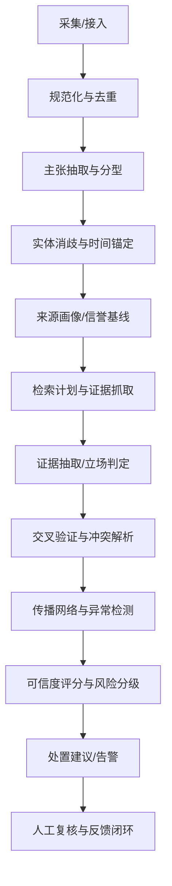
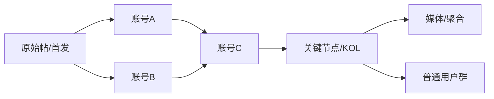

# 面向新文化媒体传播的 TOG/TOB AI 舆情分析与谣言核验流程重构报告

## 执行摘要

你当前的 8 步推理流程在“面向单条谣言给出可信度与结论”的方向是正确的，但存在三个会直接影响 TOG/TOB 可用性的结构性问题：其一，**缺少可操作的证据链与可追溯日志**，导致结论无法被业务人员复核或落地处置；其二，**对时效性高度敏感的技术类/产品类主张过度依赖静态常识**，容易出现“知识过期→误判”的系统性风险；其三，**来源评估、传播分析与人工复核触发条件缺乏量化阈值**，难以形成稳定的 SOP 与告警机制。以上问题在舆情系统里尤为致命，因为你面对的是**快速演化的信息生态**，并且 TOG/TOB 客户通常要求“可解释、可审计、可复现”的证据化输出。NIST 的 AI 风险管理框架也强调治理、测量与管理的闭环，尤其要求对风险、影响与不确定性进行系统化管理与记录。 citeturn0search2turn0search6

基于你给出的示例（“关键词：openal出版gpt5.3模型”），现有流程的一个典型误差来源是：步骤中将“GPT 最新版本为 GPT‑4”作为硬前提进行“物理/时间线检查”，这类判断在 AI 领域极易过期。仅以近期公开信息为例，OpenAI 已发布 GPT‑5，并在官方渠道发布了 GPT‑5.3‑Codex 相关介绍；同时模型发布说明与 API 模型列表端点也提供了可用于自动核验的官方入口。 citeturn6search0turn6search1turn5search1

本报告给出一套可落地的重构方案，核心产出包括：  
一套不少于 10 步的“可审计推理 + 证据工程”流程（含每步目的、输入、方法、输出、指标阈值与模板）；TOG/TOB 可直接使用的来源评估矩阵；可解释的加权可信度模型与示例计算；外部数据源与 API 接入清单（优先官方/原始来源）；可视化需求与 mermaid 示例；自动化实现建议与工具栈；KPI 与测试用例设计；风险伦理与缓解措施；以及 3 个月内的分阶段交付物与里程碑（未指定项已标注“未指定”）。

未指定但对落地影响较大的输入约束包括：目标覆盖平台（如微博/抖音/小红书/公众号等）、数据获取方式与授权范围、SLA（告警延迟）、数据保留与合规边界、目标行业与“高影响事件”定义口径（均未指定）。这些不阻碍你先做可复用的核验与评分引擎，但会影响连接器与合规方案选型。 citeturn4search3turn4search0turn4search2

## 现有八步输出的主要缺陷与重构原则

你的示例输出结构（preprocessing→physical_check→logical_check→source_analysis→cross_validation→anomaly_detection→evidence_synthesis→self_reflection）在“研究叙事”上完整，但在“产品化交付”上存在缺口。

缺陷一是**把“推理过程”当作“证据”**。例如“缺乏官方文档；无相关论文”属于推理结论，但没有输出“检索范围、查询式、命中结果、证据片段、证据等级”等可复核信息，导致 TOG/TOB 客户难以把它当作可执行情报（尤其是政府侧的审计与留痕需求）。NIST AI RMF 强调风险管理需要可测量、可追溯与治理机制支撑，而不是仅靠主观推断。 citeturn0search2turn0search6

缺陷二是**未区分“信息类型→核验路径”**。新文化媒体传播中，谣言可能是产品发布、政策解读、人物言论、突发事件、二创剪辑、讽刺反串等不同类型。信息失序研究通常区分 mis/dis/mal-information，并强调意图、语境与传播机制的差异；事实核查行业也强调一致标准与透明方法。 citeturn0search0turn3search1

缺陷三是**来源分析不够“结构化”**。你将“frontend_html5”一句带过，但缺少：来源类型（官方/媒体/自媒体/论坛/聚合站）、身份认证、历史可信度、是否存在“二手转述”、是否给出可核验的原始引用等。事实核查生态中，ClaimReview 等结构化事实核查标记与 Google Fact Check API 也体现了“结构化可引用”的重要性。 citeturn3search0turn3search2

因此重构原则建议遵循四条：  
第一，**证据优先**：先“找原始来源/官方记录”，再做推理（与 SIFT 方法“停一停、找来源、横向检索、回到原始语境”的思想一致）。 citeturn0search15turn0search7  
第二，**分型施策**：不同主张类型走不同核验路径（政策/产品/健康/安全/人物言论等）。 citeturn0search0turn1search0  
第三，**量化阈值**：每一步给出可自动化的指标与人工复核触发条件。 citeturn0search2  
第四，**闭环学习**：人工复核结果回流，校准权重、阈值与来源画像，形成持续改进。 citeturn0search2  

## 重构后的分步推理与取证流程

下面给出一套“可审计、可复现、适合工程化”的 12 步流程。你可以把它理解为：从“文本→结构化主张→证据检索→证据立场→传播异常→评分与处置→复核闭环”的流水线。流程既吸收学术界对谣言系统的经典四组件（检测、跟踪、立场、真实性）思路，也补齐了 TOG/TOB 所需的审计与处置环节。 citeturn1search0turn1search4

上图所示的“先结构化、再取证、再评分”是为了避免你现有流程中“用静态知识直接否定”的问题，尤其对“产品发布/模型更新”这类强时效信息，要优先查询官方发布与 API 列表端点。 citeturn5search1turn5search2turn6search1

### 分步流程明细

下表为每一步提供：目的、输入、方法/算法、输出、量化指标与阈值、示例模板（可直接落到日志与报告结构）。阈值为建议初值，需要通过你后续 KPI 测试集校准。

| 步骤 | 目的 | 输入 | 方法/算法 | 输出 | 可量化指标与阈值（建议初值） | 示例模板（结构化日志/报告片段） |
|---|---|---|---|---|---|---|
| 采集与溯源固化 | 固化“原始样本”以可复现；保全证据链 | 原文、平台、URL/帖ID、发布时间、作者ID、转评赞、媒体类型（图文/视频） | 采集时写入不可变存储；抓取原文快照；记录哈希（内容指纹） | `raw_evidence_bundle`（含快照与元数据） | 采集成功率≥99%；快照延迟≤60s（未指定SLA时默认） | `{"claim_id":..., "platform":..., "post_id":..., "captured_at":..., "content_hash":..., "snapshot_uri":...}` |
| 规范化与清洗 | 降噪、统一编码、处理表情/多语言/错别字；为后续抽取做准备 | 原始文本/ASR 文本 | 语言识别；URL/标签/表情归一；敏感信息最小化；分句 | `normalized_text`、`lang`、`noise_tokens` | 语言识别置信度≥0.9；噪声占比>40%触发“低质量内容”标记 | `{"normalized_text":..., "lang":"zh", "noise_ratio":0.18}` |
| 去重与聚类 | 把转发、洗稿、多平台搬运聚为同一“谣言簇”，避免重复核验 | `normalized_text`、图片/视频指纹 | 文本 SimHash/MinHash；短文本可用 n-gram + Jaccard；图片 pHash；聚类（HDBSCAN/连通分量） | `cluster_id`、重复率、代表帖 | 同簇阈值：SimHash 海明距离≤3（长文本）作为起点；短文本需调参；聚类纯度需通过标注集校准 | `{"cluster_id":..., "dedup_method":"simhash", "near_dup_count":...}` citeturn1search2turn1search3 |
| 主张抽取与结构化 | 从文本中抽取“可核验主张”；避免把情绪/观点当事实 | `normalized_text` | 信息抽取：主谓宾 + 时间/地点/版本；将“关键词”映射为`claimReviewed`字段（参考事实核查结构化思路） | `claim_struct`（主张三元组/事件框架） | 主张覆盖率（人工抽检）≥90%；多主张文本拆分准确率≥85% | `{"claim_text":..., "subject":..., "predicate":..., "object":..., "qualifiers":{"time":...,"version":...}}` citeturn3search0 |
| 主张分型与风险分级 | 决定核验路径与告警强度（TOG/TOB最重要的“处置前置”） | `claim_struct`、场景（TOG/TOB） | 分类：产品发布/政策/安全事故/健康医疗/人物言论/娱乐八卦/讽刺反串等；结合 mis/dis/mal-information 的“意图与语境”维度 | `claim_type`、`impact_level`、`risk_flags_init` | 高影响触发：涉及公共安全/金融/政策且传播速度>阈值→强制人工复核 | `{"claim_type":"产品发布","impact_level":"M","flags":["UNVERIFIED_CLAIM"]}` citeturn0search0turn0search5 |
| 实体消歧与别名对齐 | 解决“openal/OpenAI/OpenAL”这类歧义与错拼；避免误判 | 实体词、上下文窗口 | 候选实体生成（编辑距离/拼写纠错/embedding近邻）；实体链接到知识库（Wikidata/内部词表）；输出歧义分布 | `entity_candidates`、`disambiguation_conf` | 若 top1-top2 差距<0.15 → 标记 `NEEDS_REVIEW` 或进入“多路径检索” | `{"entity":"openal","candidates":[{"id":"OpenAI","p":0.54},{"id":"OpenAL","p":0.46}]}` citeturn5search0turn5search8 |
| 时间锚定与版本一致性检查 | 把“现在是否已发布”转为可核验查询；避免静态知识过期 | `claim_struct`、抓取时间 | 时间解析；“版本号合理性”不再用常识判定，而是触发“官方发布/模型列表检索”；对模型类主张优先走官方 release notes/API models | `timeline_assertions`、`freshness_ok` | 若主张涉及“新品/版本”且证据缺失→默认 `UNVERIFIED_CLAIM` 而非直接判假 | `{"time_anchor":"2026-02-14","freshness_plan":["openai_release_notes","openai_models_api"]}` citeturn5search2turn5search1turn6search1 |
| 来源画像与信誉基线 | 给每个信源一个可解释“基线分”，并决定人工复核门槛 | 账号/域名/媒体类型/历史内容 | 来源矩阵评分（见下节）；域名注册/历史改名/转载链路；是否引用原始来源 | `source_score`、`source_profile` | 低信誉源（<0.3）且影响等级≥M→自动进入复核队列 | `{"source_type":"自媒体聚合","source_score":0.25,"signals":["no_byline","no_primary_citation"]}` citeturn3search1 |
| 检索计划与证据采集 | 用“可复现检索”替代“我搜了没找到”；保证审计可追踪 | `claim_struct`、实体候选、时间窗口 | Query 扩展（同义/别名/中英互译）；分层检索：官方→权威媒体→学术/专利→事实核查库→全网；记录查询式与命中 | `retrieval_log`、`evidence_set`（含证据等级） | 官方源命中≥1 即提升证据等级；若检索覆盖<3类来源→标记 `NO_DATA_RISK` | `{"queries":[...],"sources_searched":["openai.com","help.openai.com","/models","news"],"hits":...}` citeturn5search1turn6search1turn2search1turn2search7 |
| 证据抽取与立场判定 | 判断证据对主张是支持/反对/无关；避免“只要提到关键词就算证据” | `evidence_set` | 证据片段抽取（引用句、标题、发布日期、作者）；NLI/立场分类（support/deny/unclear）；证据可信度继承来源分 | `evidence_cards`、`stance_distribution` | 支持证据≥2 且至少 1 个为官方/一级源→强支持；冲突证据存在则进入冲突解析 | `{"evidence_id":...,"stance":"SUPPORT","snippet":...,"source_tier":1}` citeturn1search0turn3search0 |
| 交叉验证与冲突解析 | 面对“媒体转述不一致/标题党/断章取义”时给出可解释结论 | `evidence_cards` | 冲突图：按时间排序；优先级：原始发布>二手转述；一致性评估；输出“可证实部分/不可证实部分/误导点” | `validation_summary`、`conflict_notes` | 冲突强度>0.6（定义为高权威证据相互矛盾）→必须人工复核 | `{"confirmed_part":...,"misleading_part":...,"unknown_part":...}` citeturn0search15turn3search1 |
| 传播网络与异常检测 | 把“传播异常”从主观描述变为量化信号（刷量/水军/协同转发） | `cluster_id`、平台扩散数据 | 传播曲线与突发检测（Kleinberg burst）；网络图（转发/提及）；中心性、社群；异常：新号比例、同步发布、内容模板化 | `spread_metrics`、`anomaly_score`、可疑账号列表（仅内部） | burst 强度>阈值 或 1h 增长率>阈值→告警；异常分>0.7→标记 `COORDINATED_BEHAVIOR` | `{"burst_level":2,"growth_1h":3.4,"anomaly_score":0.72}` citeturn1search5turn1search0 |
| 可信度评分、结论与处置建议 | 输出 TOG/TOB 可直接行动的结论：可信度、证据链、建议动作 | 上述全部中间产物 | 加权可信度模型（见后节）；映射等级；生成“处置建议”：继续监测/发布澄清/内部通报/升级法务等 | `final_score`、`label`、`action_recommendations`、审计包 | 评分校准：Brier 分数下降；人工复核通过率提升 | `{"final_score":0.78,"label":"LIKELY_TRUE","actions":["update_knowledge_base","close_alert"]}` citeturn0search2turn3search1 |
| 人工复核与反馈闭环 | 控制误判成本；持续校准阈值与权重 | 复核队列、证据包 | 双人复核/仲裁；记录原因码；更新来源画像、黑白名单、权重；写入训练集 | `review_decision`、`reason_codes`、模型更新任务 | 人工复核命中率（需要复核的确实有问题）≥60%；复核平均耗时≤X（未指定） | `{"review":"OVERRULED","reason_codes":["ENTITY_AMBIGUITY","OFFICIAL_EVIDENCE_FOUND"]}` citeturn0search2 |

### 针对示例主张的“应输出什么”示范要点

对“关键词：openal出版gpt5.3模型”，重构后系统不应仅输出“LIKELY_FALSE”，而应至少呈现以下可操作信息：  
其一，“openal”存在明显歧义：可能是 OpenAI 的错拼，也可能是音频库 OpenAL；需要实体消歧并展示候选概率。 citeturn5search0turn5search8  
其二，对“GPT‑5.3”这类强时效版本主张，应优先检索官方发布与模型发布说明；目前 OpenAI 官方已发布 GPT‑5 与 GPT‑5.3‑Codex 介绍页面，这会显著改变可信度判断。 citeturn6search0turn6search1  
其三，即便“确有 GPT‑5.3‑Codex”，原句“出版 gpt5.3 模型”仍可能存在“表述不精确/以偏概全”（把 Codex 变体说成通用 GPT‑5.3）；因此输出应包含“可证实部分/不可证实部分/误导点”，而不是二元真伪。 citeturn6search1turn5search2  

## TOG/TOB 场景的来源评估矩阵

TOG/TOB 的核心差异在于：TOG 更关注公共利益、合规与可审计，倾向更高的人审占比；TOB 更关注品牌风险、商业决策时效与成本，倾向更自动化但必须可解释。来源评分应同时支持两类场景：给出“基线信誉分”，并明确“何时必须人工复核”。事实核查组织的原则强调透明、公正与方法可复现，为你设计来源评分规则提供了行业参照。 citeturn3search1turn3search12

### 来源评估矩阵（可直接落地为规则引擎）

下表给出“来源类型→评分规则→自动检测信号→人工复核触发条件”的产品化矩阵。评分建议范围为 0–1（越高越可信），并可在 TOG/TOB 侧分别配置不同权重（未指定默认一致）。

| 来源类型 | 适用场景 | 信誉评分规则（示例，可配置） | 自动化检测信号（可观测） | 人工复核触发条件（建议） |
|---|---|---|---|---|
| 官方发布/官方文档/官方公告（含组织官网、官方 Help Center、官方 API 文档） | TOG/TOB 通用，一级证据 | 基线 0.90；若存在明确发布日期、版本说明、作者/组织署名、可验证链接→+0.05（上限 1.0） | 域名白名单；HTTPS；页面结构稳定；引用链自洽；与 API 端点/目录一致 | 若与其他一级证据冲突；或页面疑似被篡改（结构/哈希异常） citeturn6search1turn5search2turn5search1 |
| 权威媒体（一手采访/明确引用官方原文） | TOG/TOB 重要补充 | 基线 0.75；若提供原始引用或可追溯材料→+0.1；若标题党/夸大→-0.1 | 是否包含原始链接；作者署名；更正记录；引用一致性 | 涉及重大公共利益但仅媒体转述、无原文链接→复核 |
| 事实核查机构/结构化事实核查库（ClaimReview） | TOG/TOB 适合“快速对照” | 基线 0.80；若为 IFCN 签署方或可公开方法→+0.1 | 是否存在 ClaimReview 标记；是否可通过 Fact Check API 检索 | 事实核查结论与官方证据冲突；或主张发生版本更新（旧核查过期） citeturn3search0turn3search2turn3search1 |
| 学术与专利元数据（Crossref/arXiv/Wikidata 等） | 技术/科研类主张 | 基线 0.70（元数据层）；若能定位 DOI、arXiv ID、作者机构→+0.1 | DOI/ID 可解析；发布时间与作者一致性；可批量更新 | 仅存在二手解读，无原始论文/专利 ID →复核 citeturn2search1turn2search7turn3search3 |
| 行业博客/公司技术博客（非官方公告口径） | TOB 常见 | 基线 0.45；若信息可被官方/多源证据印证→上调 | 是否长期稳定输出；是否引用原文；域名年龄与历史 | 作为唯一证据且影响≥M →复核 |
| 自媒体/内容平台账号（个人号/营销号/搬运号） | 新文化传播主战场 | 基线 0.20–0.40，按认证、历史准确率、是否频繁搬运调整 | 新号比例；内容模板化；跨平台同步；无引用 | 传播速度快或涉及高影响主题→强制复核 citeturn1search0turn1search5 |
| 聚合/转载站（无编辑责任、无署名、无原始引用） | 风险高 | 基线 0.10–0.25；若能溯源到可靠原文则不以聚合站作为证据 | 无署名；大量转载；站内重复内容 | 任何影响≥L 的结论不可仅依赖此类来源（自动标记 `LOW_CREDIBILITY_SOURCE`） |

### 自动化“人工复核触发器”建议集合

建议把人工复核触发器做成规则集（可多选叠加），并记录触发原因码，便于后续 KPI 分析与阈值校准（原因码体系未指定）。典型触发条件包括：  
当实体消歧不确定（top1-top2<0.15）；当官方/一级证据缺失且传播异常显著；当出现高权威证据冲突；当主张属于政策、公共安全、金融等高影响类型；当短期传播突发（burst）达到阈值。突发检测可参考 Kleinberg 的 burst 模型思想，将“常态频率→异常强度”结构化。 citeturn1search5turn0search2turn4search0  

## 可解释的可信度计算模型与示例计算

你原输出给出“最终可信度 0.35”，但缺少“如何算出来”。TOG/TOB 客户通常需要：  
一是可解释：每个维度的贡献清晰；二是可校准：能用标注集做参数学习与误差分析；三是可审计：能回放当时的证据集与权重。

### 建议的可解释加权模型

定义每个维度均归一化到 \[0,1\]：

- **S：来源基线**（Source Credibility）：由来源评估矩阵得到（可按“原始来源优先”聚合）。  
- **E：证据支持度**（Evidence Support）：支持证据数量、证据等级与质量的函数。  
- **C：交叉一致性**（Cross-validation Agreement）：多源是否一致、是否存在高权威冲突。  
- **T：时效匹配度**（Timeliness/Freshness）：证据发布时间与主张时间是否匹配；对“新品/版本”特别重要。  
- **P：内容可置信性**（Plausibility）：与已知事实/知识库的一致性，但必须以“可更新知识库”为前提，避免静态常识误判。  
- **A：传播异常惩罚**（Anomaly Penalty）：刷量/协同行为、异常增长等。  
- **U：不确定性惩罚**（Uncertainty Penalty）：检索覆盖不足、实体消歧不确定、证据稀缺等。

给出一个线性可解释模型（便于业务沟通），并做截断：

\[
\text{Cred} = \text{clip}\Big(
w_S S + w_E E + w_C C + w_T T + w_P P \;-\; w_A A \;-\; w_U U,\; 0,\;1
\Big)
\]

权重建议初值（可按 TOG/TOB 配置，未指定默认通用）：

- \(w_S=0.20\), \(w_E=0.30\), \(w_C=0.15\), \(w_T=0.15\), \(w_P=0.10\), \(w_A=0.05\), \(w_U=0.05\)（正向权重和为 0.90，惩罚项总 0.10；可按校准调整）。  
评分等级映射建议：  
≥0.85 TRUE；0.65–0.85 LIKELY_TRUE；0.45–0.65 UNCERTAIN；0.25–0.45 LIKELY_FALSE；<0.25 FALSE（阈值可校准）。

### 示例计算：同一主张在“证据缺失”与“找到官方证据”时的差异

以示例“openal出版gpt5.3模型”为例，系统应允许两种情景输出，体现“证据到来后可自动更新结论”。

情景 A：仅有低质量转载/聚合来源，无法找到官方发布或模型列表印证（典型早期谣言阶段）  
- S=0.25（来源为聚合站/营销号）  
- E=0.10（缺乏一级证据，只有转述）  
- C=0.30（多源一致性弱）  
- T=0.40（时间表达模糊）  
- P=0.50（内容未必荒谬，但无法确认）  
- A=0.20（传播异常不强）  
- U=0.60（检索覆盖不足、实体歧义未解决）

代入：Cred ≈ clip(0.2×0.25 + 0.3×0.10 + 0.15×0.30 + 0.15×0.40 + 0.1×0.50 − 0.05×0.20 − 0.05×0.60)  
= clip(0.05 + 0.03 + 0.045 + 0.06 + 0.05 − 0.01 − 0.03)  
= **0.195** → FALSE/LIKELY_FALSE（并标记“NO_DATA_RISK”与“NEEDS_REVIEW”）

情景 B：检索命中 OpenAI 官方发布“GPT‑5.3‑Codex”，并且模型发布说明/官方渠道支持“确有 GPT‑5 与相关变体发布”，但原句仍存在实体错拼与概念泛化风险  
- S=0.90（官方发布为一级证据） citeturn6search1turn6search0  
- E=0.85（至少 1 个一级证据 + 多个二级证据可佐证） citeturn6search1turn5search2  
- C=0.75（官方与多方报道一致，但“openal”歧义导致结论需限定） citeturn6search1turn5search0  
- T=0.90（证据发布时间与主张时间匹配） citeturn6search1  
- P=0.80（与官方发布一致，但需限制为“GPT‑5.3‑Codex”而非泛称“GPT‑5.3”） citeturn6search1  
- A=0.20（传播异常一般）  
- U=0.20（仍有实体/表述不精确不确定性）

Cred ≈ 0.2×0.90 + 0.3×0.85 + 0.15×0.75 + 0.15×0.90 + 0.1×0.80 − 0.05×0.20 − 0.05×0.20  
= 0.18 + 0.255 + 0.1125 + 0.135 + 0.08 − 0.01 − 0.01  
= **0.7425** → LIKELY_TRUE（但应输出“表述需修正/限定范围”：更准确为“OpenAI 发布了 GPT‑5.3‑Codex（及相关变体）”，并提示“openal 可能为 OpenAI 错拼；OpenAL 另指音频库”。 citeturn6search1turn5search0turn5search8）

这类“同一主张随证据更新自动重评分”的能力，是舆情系统对抗“信息时效性”与“知识过期误判”的关键。

## 外部数据源与 API 接入清单

你需要把“检索与核验”做成可插拔的数据源层，遵循“官方/原始来源优先”的证据等级策略。下表给出推荐接入（优先级、用途、频率建议）。频率以“默认运行在分钟级监测 + 小时级聚合 + 日级对账”为思路；具体 SLA 与 QPS 约束未指定。

| 优先级 | 数据源/API | 用途 | 为什么优先 | 建议调用频率 |
|---|---|---|---|---|
| P0 | 官方发布页/官方公告（组织官网、官方博客、官方 Help Center） | 核验产品发布、政策公告、澄清声明 | 一级证据；可直接支持/反驳主张 | 对高影响主题：分钟级轮询/订阅（如有 RSS）；一般：小时级 |
| P0 | OpenAI API：Models 列表与模型信息端点 | 对“模型是否存在/是否可用”进行程序化核验 | 官方 API 文档明确提供模型对象与列表端点 | 触发式（命中“模型/版本发布”主张才调用），并做缓存 citeturn5search1 |
| P0 | OpenAI 模型发布说明（Model Release Notes） | 对“版本更新/退役/变更”做时效核验 | 官方变更日志可作为证据链的重要节点 | 日级同步 + 触发式复查 citeturn5search2turn6search3 |
| P1 | Google Fact Check Tools API（Claim Search） | 快速查询是否已有事实核查结论 | 可直接对接结构化事实核查结果 | 日级批量 + 告警触发式查询 citeturn3search2 |
| P1 | Schema.org ClaimReview / 相关事实核查数据集 | 统一事实核查结果的结构化表示 | 行业常用结构，有利于对接外部核查生态 | 与 Fact Check API 配套使用 citeturn3search0turn3search8 |
| P1 | GDELT（新闻全文检索/时间线） | 跨媒体/跨语言新闻覆盖与时间线对照 | 提供大规模新闻检索能力，适合“是否被主流报道/何时出现” | 小时级或按簇触发式 citeturn2search0 |
| P1 | Wikidata SPARQL | 实体知识、别名、组织/人物基础信息对齐 | 强实体链接能力，适合消歧与元信息补全 | 触发式 + 缓存 citeturn3search3 |
| P2 | Crossref REST API | 学术 DOI 元数据核验（论文是否存在、作者、期刊） | 原始元数据权威且可 API 查询 | 触发式（技术/科研主张）+ 周级缓存更新 citeturn2search1turn2search9 |
| P2 | arXiv OAI-PMH / arXiv API | 预印本与元数据更新 | arXiv 明确推荐 OAI-PMH 用于批量与持续更新 | 日级增量同步；突发事件触发式查询 citeturn2search3turn2search7 |
| P2 | 中国政府网/人大网（政策法规全文） | TOG 场景的政策真实性核验与合规引用 | 原始法条与部门规章全文可靠 | 周级同步（政策变更相对低频） citeturn4search0turn4search2turn4search3 |

说明：示例中“openal/OpenAI”类核验，优先使用官方发布页与官方 Models 端点，是为了避免仅依赖媒体转述带来的偏差。OpenAI 已在官网发布 GPT‑5 与 GPT‑5.3‑Codex 相关页面，属于可直接引用的一级证据。 citeturn5search10turn6search1turn5search1  

## 可视化需求与示例

TOG/TOB 舆情产品的可视化不应只展示“热度”，还应展示“证据链、时间链与传播链”。建议至少包含四类视图：

表格类：用于“列表筛选与操作”。包括：主张列表、评分、风险标记、证据覆盖度、传播速度、处置状态、负责人（未指定）。  
时间线：用于回答“什么时候开始、什么时候扩散、什么时候出现辟谣/官方声明”。  
传播网络图：用于识别关键传播节点、社群、疑似协同行为。  
可信度分布图：用于对全局舆情做风险盘点（例如某主题下 LIKELY_FALSE 的占比）。

### 图表类型建议

表格：交互式数据表（支持筛选、排序、钻取）。  
时间线：折线图 + 关键事件标注（官方发布点、媒体报道点、平台治理点）。  
传播网络：力导向图/分层树（转发链）+ 社群着色；节点大小=影响力（中心性）。  
可信度分布：直方图/密度图/箱线图（按主题、平台、时间窗口分布）。

### mermaid 示例：传播网络（简化示意）

传播异常检测建议同时呈现“曲线 + burst 标记”，burst 可参考 Kleinberg 的层级突发结构，将异常强度结构化展示，便于告警解释。 citeturn1search5  

## 自动化实现建议与推荐技术栈

### 证据工程与检索层

为了让你的输出从“像推理”变成“可核验”，需要把检索与证据抽取做成“标准化组件”，并记录检索日志（query、时间、来源、命中、证据片段）。对“模型/版本发布”类主张，应优先调用官方发布说明与 API models 端点，避免静态知识误判。 citeturn5search1turn5search2turn6search1

建议组件化模块（均可自动化）：
检索：多策略（关键词检索 + 语义检索 + 站点限定 + 时间限定）。  
去重：SimHash/MinHash（文本）+ pHash（图片）+ 近重复聚类；SimHash/MinHash 经典文献可作为你工程选型依据。 citeturn1search2turn1search3  
语义比对与立场：NLI/stance（支持/反对/不确定），并输出证据片段与出处。谣言系统常被拆为 detection/tracking/stance/veracity 四组件，你的系统可直接采用该分解，降低复杂度。 citeturn1search0turn1search4  
跨语言：以“实体对齐 + 多语 embedding + 机器翻译”三件套做最小可用；对关键证据仍需回到原文语境（符合 SIFT “找原始来源”的思想）。 citeturn0search15  

### 实时监测与告警规则

告警不应只看“热度”，而应结合“可信度×传播速度×影响等级”。建议默认规则：  
当 Impact≥M 且 Cred≤0.45 且 1h 增长率>阈值 → 红色告警；  
当 Cred 处于 0.45–0.65（不确定）但 burst 强 → 黄色告警并进入复核；  
当官方一级证据出现且与当前结论冲突 → 自动重算并触发“结论更新告警”。

传播突发检测可采用 Kleinberg burst 思路；这个选择的好处是可解释：它输出的是“从常态到异常”的层级变化，而不是黑盒分数。 citeturn1search5  

### 技术栈与开源工具推荐（候选）

以下为“候选实现方向”，便于你快速搭 MVP；具体选型取决于预算、团队栈与部署环境（未指定）：

存储与检索：倒排索引（如 Elasticsearch/OpenSearch 类）+ 向量检索（如 FAISS/Milvus/pgvector 类）+ 对象存储（证据快照）。  
流式与任务：消息队列/事件流（Kafka 类）+ 任务编排（Airflow 类）用于日级同步（如 arXiv OAI-PMH、Crossref）。arXiv 明确说明 OAI-PMH 用于持续更新元数据，适合做日级增量。 citeturn2search7turn2search3  
图分析：图数据库（Neo4j 类）或图计算库（NetworkX 类）用于传播网络与社群分析（实现细节未指定）。  
事实核查对接：ClaimReview 结构化处理与 Fact Check API。 citeturn3search0turn3search2  
合规与治理：数据最小化与审计日志；中国个人信息保护法对个人信息处理与适用范围有明确规定，你的采集与留存需要按“最小必要”设计。 citeturn4search3  
算法治理：若系统提供算法推荐或具有舆论属性/社会动员能力，需要关注中国对算法推荐与生成式 AI 服务的相关规章要求（适用性取决于你产品形态，未指定）。 citeturn4search0turn4search2  

## KPI、测试用例与风险伦理

### 系统级 KPI 建议

建议把 KPI 分成三层：核验质量、监测时效、运营成本。

核验质量：
主张抽取准确率（claim extraction F1）；立场判定准确率（support/deny/unclear）；最终标签准确率与宏平均 F1；可信度分的校准指标（如 Brier/可靠性曲线）；证据覆盖率（每条结论平均引用证据数、一级证据占比）。学术界对谣言系统的四组件分解，可以直接对应你的模块化评测。 citeturn1search0turn1search4

监测时效：
TTD（time-to-detect，首次出现→系统识别）；TTV（time-to-verify，首次出现→给出可用证据链结论）；告警延迟（未指定 SLA 时建议先采集统计分布）。突发传播检测可与 TTD 指标绑定。 citeturn1search5

运营成本：
人工复核占比、复核命中率（被送审的确实需要人审）、平均复核时间、每千条舆情的人工工时。

### 测试用例与正负样本设计思路

为了避免“像你示例那样因知识过期误判”，测试集必须包含“时效性挑战样本”。

正样本（TRUE/LIKELY_TRUE）：
官方发布已证实但在社媒早期传播时缺乏主流媒体覆盖的案例；多语言发布（中英版本不一致但本质一致）的案例；“官方更新/版本迭代”案例（例如模型更新或政策更新）。OpenAI 官方发布 GPT‑5 与 GPT‑5.3‑Codex 的页面可作为“官方证据充足”的样例源。 citeturn5search10turn6search1

负样本（FALSE/LIKELY_FALSE）：
仅自媒体/聚合站传播、无法溯源原始出处的“悬浮信息”；断章取义与标题党（正文否定标题肯定）；伪造截图/拼接图（需要多模态指纹与溯源，细节未指定）。

不确定样本（UNCERTAIN）：
实体歧义（openal/OpenAI/OpenAL）；主张包含可证实与不可证实部分（“确有 GPT‑5.3‑Codex，但说成通用 GPT‑5.3”）；证据冲突（权威证据相互矛盾）——这些样本用于验证你的“冲突解析与人审触发”机制。

回归测试：
对同一簇谣言，随着时间推移加入新证据，系统是否能自动重算并更新结论（这是你产品稳定性的关键）。

### 风险与伦理考量及缓解措施

误判风险：
误把真实信息判假，会伤害媒体公信力与客户决策；误把谣言判真，会放大风险。缓解：引入不确定性 U 与强制人审触发器；对“新品/版本”类主张默认“不证实≠判假”，先标记 UNVERIFIED 并持续监测。NIST AI RMF 强调对风险与不确定性进行治理与管理闭环。 citeturn0search2turn0search6

偏见风险：
来源评分可能对小媒体/新账号系统性低分，导致“新信息难以被看见”。缓解：评分用于“置信度”而非“可见性封禁”；对低分但高一致性、多证据支持的内容允许上调；记录并评估不同群体/平台的误差分布（公平性评估方案未指定）。

隐私与合规：
舆情系统可能涉及个人信息（账号 ID、行为轨迹）。缓解：数据最小化、脱敏、访问控制、留存周期与目的限制；遵守个人信息保护法的适用范围与处理规则。 citeturn4search3

滥用风险：
系统可能被用于定向打击异见或制造舆论。缓解：权限分级、审计日志、用途声明、导出限制；对“处置建议”做边界：建议“核验与澄清”而非“压制”。（治理策略细节未指定）

## 交付物清单与三个月里程碑

### 交付物清单

建议以“可审计闭环”为中心组织交付物：

产品与流程文档：
核验流程 SOP（含 12 步、阈值、人工复核规则）；来源评估矩阵与白名单机制；风险标记字典（UNVERIFIED_CLAIM、NEEDS_REVIEW 等）；示例报告模板（单条/专题/日报周报）；合规与数据治理说明（未指定地区则给中性模板）。 citeturn4search0turn4search2turn4search3

工程与接口：
数据模型（claim、evidence、source、cluster、timeline、graph）；评分服务 API 规范（输入/输出/原因码）；证据检索日志规范；人工复核工作台需求与接口；外部源连接器清单（按优先级）。 citeturn5search1turn3search2turn2search1

可视化原型：
舆情列表页（含可信度/影响等级/证据覆盖）；单条谣言“证据链卡片 + 时间线 + 传播网络”页；可信度分布与主题风险盘点仪表盘原型。

### 三个月内分阶段目标

以下按“先 MVP 可用→再证据工程增强→再规模化评测与治理”推进。

第一阶段：第一个月（MVP 上线）
完成采集、规范化、去重聚类、主张抽取、来源基线评分、基础检索（至少 P0 官方源）、基础报告输出与审计日志；对“模型/版本发布”主张接入 OpenAI 官方发布/发布说明/API models 的核验路径作为标杆场景。 citeturn6search1turn5search2turn5search1  
里程碑输出：可跑通端到端、能对单条谣言给出“证据链 + 置信度 + 复核触发原因”。

第二阶段：第二个月（证据与传播增强）
引入交叉验证、冲突解析；接入 Fact Check API 与 ClaimReview（P1）；加入传播突发检测与基础网络图；建立人工复核工作流与原因码体系；开始构建标注集与离线评测。 citeturn3search2turn3search0turn1search5turn1search0

第三阶段：第三个月（评测、校准与 TOG/TOB 适配）
建立 KPI 仪表盘（准确率、校准、TTD/TTV、复核成本）；用标注集校准权重与阈值；引入跨语言与实体消歧强化；完善合规与数据治理说明；输出面向 TOG/TOB 的差异化配置（人审比例、告警策略、证据保全）。相关合规要求可参考中国算法推荐、深度合成、生成式 AI 服务管理与个人信息保护等规章文本，具体适用性取决于你产品是否属于相关定义范围（未指定）。 citeturn4search0turn4search1turn4search2turn4search3

---

以上重构的关键不是“让 AI 多想几步”，而是把“想”变成“可核验的证据工程 + 可解释的评分模型 + 可运行的处置闭环”。在你提供的示例场景里，最大的增益来自两点：对强时效主张优先走官方核验（如模型发布与 models 端点），以及把实体歧义（openal/OpenAI/OpenAL）显式化并与人工复核触发器绑定。 citeturn6search1turn5search1turn5search0turn5search8